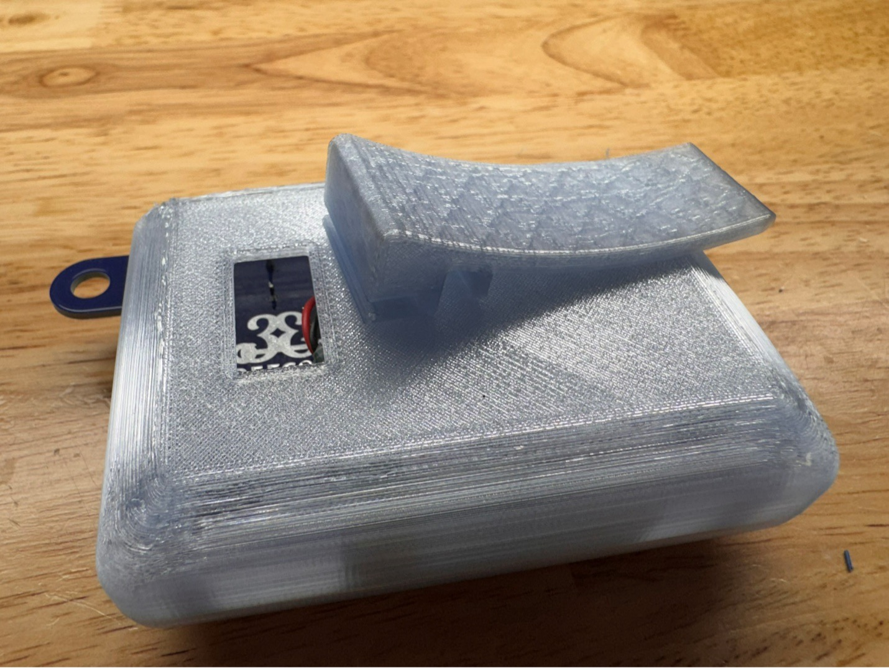
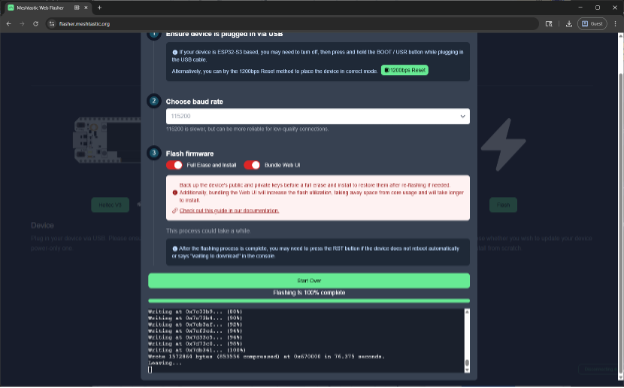

# DC33 CompuNet Badge - The Meshtastic Express

Introducing **The Meshtastic Express** — the open-source, networkless pager built for hackers, tinkerers, and technophiles. Powered by the Meshtastic protocol and fully customizable from the firmware up, this device lets you send messages over a decentralized mesh network — no cell towers, no Wi-Fi, no problem. Flash your own firmware, tweak the hardware with this highly customizable device and relive the 1990’s glory of belt-clip attached electronics.

Meshtastic devices use **LoRa (Long Range)** radio technology to send small data packets over several kilometers. Each device acts as a node in the mesh, forwarding messages to others until they reach their destination. Learn more at: 

[https://github.com/slash128v6/DC33_Cnet_Badge](https://github.com/slash128v6/DC33_Cnet_Badge)

[https://meshtastic.org](https://github.com/slash128v6/DC33_Cnet_Badge)
 
**WARNING – DO NOT POWER THE HELTEC V3 LoRa UNIT WITHOUT THE ANTENNA ATTACHED! DAMAGE MAY RESULT**

# Section 1: Hardware Assembly

1.	Verify inventory:

| Qty	| Description |
|------|-------------|
|1	|PCB |
|1	|Heltec V3 LoRa Module Kit (includes antenna and 2x 18 pin headers)|
|1	|LiPo Battery|
|1	|GPS Module|
|1	|GPS Antenna|
|1	|Piezo Buzzer|
|1	|Vibration Motor|
|1	|6 Pin SAO Header|
|1	|12 Pin Header|
|2	|VHB Pads|
|1	|Case Bottom|
|1	|Case Top|
|1	|Case Clip|

2.	Solder the vibration motor. You can trim the wires but be very careful when stripping the ends, as the wire is very small gauge and easy to cut when stripping. Peel off the white tab and stick to the PCB. 

3.	Solder the 6 pin SAO header with the tab aligned with the white silkscreen outline. Try to keep it as square as possible so SAOs are not crooked when installed. 

4.	Solder the piezo buzzer noting the polarity. Remove the protective white sticker.

5)	Solder the Heltec V3 LoRo module to the PCB using the 2x 18 pin headers included in the kit. The short side of the pins should face up through the module and the long side should face down through the PCB. To save time soldering, only the pins marked with white dots need to be soldered. Be careful soldering the 2 pins under the display ribbon cable. The cable is heat resistant, but can melt with too much heat.

6)	Cut off 4 pins from the 12 pin header and solder the GPS module to the PCB. The short side of the pins should face up through the module and the long side should face down through the PCB.

7)	Attach the GPS antenna to the GPS module, pressing the connectors together until there is a slight click and they are parallel when viewed from the side. A fingernail or small flat bladed tool is helpful. Using one of the VHB pads affix the GPS antenna to the PCB, routing the wire underneath the lip. Make sure the GPS antenna is within the white square outline so the case will fit on later.

10)	Mount the PCB in the lower case. Route the LoRa antenna horizontally along the top edge of the PCB as shown. A piece of tape helps. Align the top half of the case onto the lower half posts and press together until the gap between the two halves is gone. 

Slide the clip into the opening on the back until it clicks into place. 

# Section 2: Flashing & Configuration

1)	Install the CP210x Universal Windows Driver from https://www.silabs.com/developer-tools/usb-to-uart-bridge-vcp-drivers?tab=downloads. 

2)	Connect the Heltec Lora V3 module to your PC with a USB-C cable. Open a browser to flasher.meshtastic.org. 

3)	Click “Select Target Device” and select the “Heltec V3” device. 

4)	Select the latest stable firmware from the dropdown menu. 

5)	Click “Flash”. 

6)	Click “Continue”.

7)	Toggle on the options “Full Erase and Install” and “Bundle Web UI” and click “Erase Flash and Install”. 

8)	A selection dialog will appear. Select the CP2102 device and click “Connect”. 

9)	Flashing will begin. Wait for it to complete. 

10)	Go to client.meshtastic.org and click “New Connection”. Don’t leave the flasher page open in another tab as it can interfere with the client connection. 

11)	Click on the “Serial” tab, then “New Device”. 

12)	A selection dialog will appear. Select the CP2102 device and click “Connect”. 

13)	Click the new device that appears. 

14)	Click on Config in the left menu, then the LoRa tab, set the location to “US”, then click the save floppy icon in the upper right corner. After the setting is saved the Heltec module will reboot. If it does not then try refreshing the page and try again.

15)	Reconnect and click on the Display tab, set the Carousel Display to “15”, then click the save floppy icon in the upper right corner. After the setting is saved the Heltec module will reboot. If it does not then try refreshing the page and try again.

16)	Reconnect and click on the Position tab, set GPS Mode to Enables, the Receive Pin to “48” and the Transmit Pin to “47” then click the save floppy icon in the upper right corner. After the setting is saved the Heltec module will reboot. If it does not then try refreshing the page and try again.

17)	Reconnect and click on Config and Module Config in the left menu, then the Ext Notif tab. Toggle on Enable External Notification then set Output Vibrate to “45” and Output Buzzer to “46” and enable all the toggle items EXCEPT “Use I2S Pin as Buzzer”, then click the save floppy icon in the upper right corner. After the setting is saved the Heltec module will reboot. If it does not then try refreshing the page and try again.

# Section 3: Operation

1)	There are 2 buttons on the left side of the display. Some common button commands:
a.	Brief single presses of the top button will cycle through the screens on the display. By default the screen will turn off after 15 seconds. You can use the top button to wake the display. You can also set a longer screen timeout in settings.
b.	A long press of the top button will put the device in shutdown mode.
c.	A triple short press of the top button will disable GPS. Repeat to re-enable GPS.
d.	A single press of the top button will wake it back up. A single press of the bottom button will reboot the device. 

2)	Download the Meshtastic app to your mobile device. It is supported on iOS and Android. Enable Bluetooth on your mobile device then open the Meshtastic app and go to the “Bluetooth” tab. You should see a list of available radios. Tap the radio with the ID that matches your device. You can view it on the info screen by cycling through with the top button.

3)	It will ask for a PIN that will be displayed on your radio’s display. Enter that PIN to connect

4)	The “Messages” tab is where you will send and receive messages. The “Primary Channel” reaches everyone on the mesh. 

5)	At this point you should have basic functionality. Feel free to explore the docs at [https://meshtastic.org/docs/introduction/](https://github.com/slash128v6/DC33_Cnet_Badge). Settings can be managed in the app as well, vs connecting to a PC and using the web interface at [https://client.meshtastic.org/](https://github.com/slash128v6/DC33_Cnet_Badge), though the web interface has more functionality. There is also a Python cli interface that allows bulk configuration changes and backup & restore. This is also covered on the Meshtastic website. A YAML config file with the basic settings applied in this doc is included in the “Software/configs” directory of the repo.